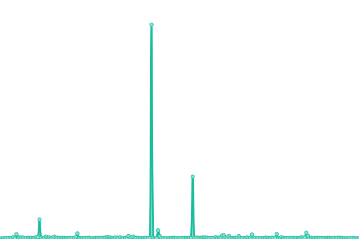
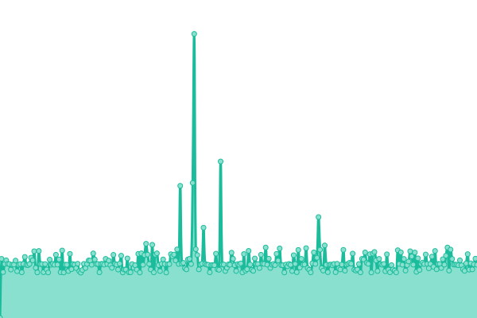
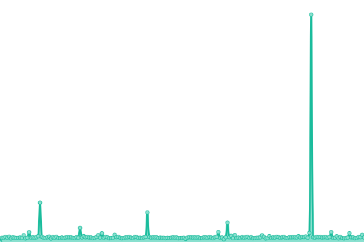
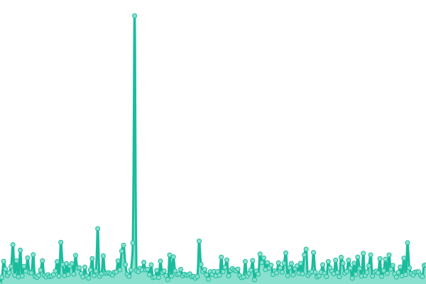
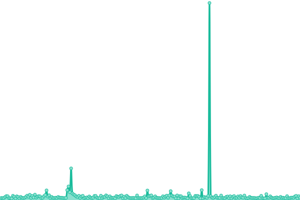

# [📈 Live Status](https://status.orionex.id): <!--live status--> **🟩 All systems operational**

This repository contains the open-source uptime monitor and status page for [orionex-solutions](https://status.orionex.id), powered by [Upptime](https://github.com/upptime/upptime).

With [Upptime](https://upptime.js.org), you can get your own unlimited and free uptime monitor and status page, powered entirely by a GitHub repository. We use [Issues](https://github.com/orionex-solutions/status-page/issues) as incident reports, [Actions](https://github.com/orionex-solutions/status-page/actions) as uptime monitors, and [Pages](https://status.orionex.id) for the status page.

<!--start: status pages-->
<!-- This summary is generated by Upptime (https://github.com/upptime/upptime) -->
<!-- Do not edit this manually, your changes will be overwritten -->
<!-- prettier-ignore -->
| URL | Status | History | Response Time | Uptime |
| --- | ------ | ------- | ------------- | ------ |
|  [Orionex Landing Page](https://orionex.id) | 🟩 Up | [orionex-landing-page.yml](https://github.com/orionex-solutions/status-page/commits/HEAD/history/orionex-landing-page.yml) | 

 192ms
     
 | 

<a href="https://status.orionex.id/history/orionex-landing-page">100.00%</a>
    

|  [Wikalpa LMS](https://lms.wikalpa.orionex.id) | 🟩 Up | [wikalpa-lms.yml](https://github.com/orionex-solutions/status-page/commits/HEAD/history/wikalpa-lms.yml) | 

 1584ms
     
 | 

<a href="https://status.orionex.id/history/wikalpa-lms">100.00%</a>
    

|  Wikalpa LMS Microservices | 🟩 Up | [wikalpa-lms-microservices.yml](https://github.com/orionex-solutions/status-page/commits/HEAD/history/wikalpa-lms-microservices.yml) | 

 600ms
     
 | 

<a href="https://status.orionex.id/history/wikalpa-lms-microservices">100.00%</a>
    

|  Orionex API Gateway (#1) | 🟩 Up | [orionex-api-gateway-1.yml](https://github.com/orionex-solutions/status-page/commits/HEAD/history/orionex-api-gateway-1.yml) | 

 657ms
     
 | 

<a href="https://status.orionex.id/history/orionex-api-gateway-1">100.00%</a>
    

|  R&D AutoInsight by Orionex (#1) | 🟩 Up | [r-and-d-auto-insight-by-orionex-1.yml](https://github.com/orionex-solutions/status-page/commits/HEAD/history/r-and-d-auto-insight-by-orionex-1.yml) | 

 266ms
     
 | 

<a href="https://status.orionex.id/history/r-and-d-auto-insight-by-orionex-1">100.00%</a>
    

|  R&D AutoInsight by Orionex (#2) | 🟩 Up | [r-and-d-auto-insight-by-orionex-2.yml](https://github.com/orionex-solutions/status-page/commits/HEAD/history/r-and-d-auto-insight-by-orionex-2.yml) | 

 479ms
     
 | 

<a href="https://status.orionex.id/history/r-and-d-auto-insight-by-orionex-2">100.00%</a>
    

<!--end: status pages-->

[**Visit our status website →**](https://status.orionex.id)

## 📄 License

- Powered by: [Upptime](https://github.com/upptime/upptime)
- Code: [MIT](./LICENSE) © [Anand Chowdhary](https://anandchowdhary.com), supported by [Pabio](https://pabio.com)
- Data in the `./history` directory: [Open Database License](https://opendatacommons.org/licenses/odbl/1-0/)
